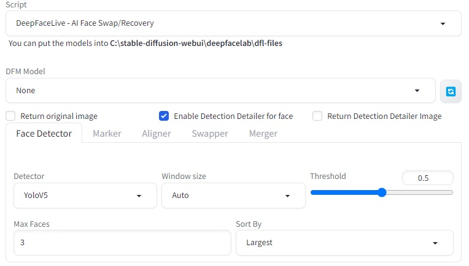
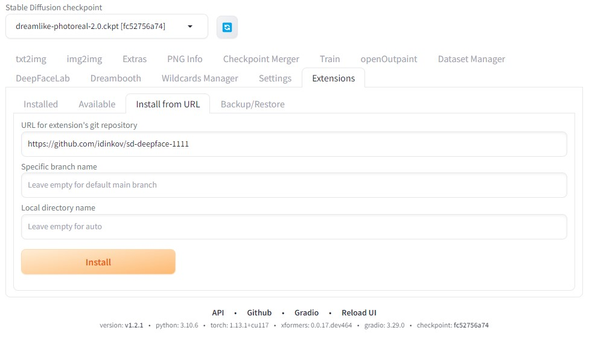

## DeepFaceLab and DeepFaceLive on Stable Diffusion

This is an implementation of iperov's DeepFaceLab and DeepFaceLive in Stable Diffusion Web UI by AUTOMATIC1111.

Note: DeepFaceLive is currently fully implemented while DeepFaceLab is in the works.

This can be installed as a plugin for https://github.com/AUTOMATIC1111/stable-diffusion-webui

DeepFaceLive is implemented as a script which can be accessed on txt2img and img2img tabs.

DeepFaceLab has a separate tab and controls to manage workspaces and train custom models.

## Use cases

- You can easily face swap any face in stable diffusion with the one that you want, with a combination of DeepFaceLab to create your model and DeepFaceLive to implement the model to be used in stable diffusion generating process.
- Enhance and make more stable and person specific the output of faces in stable diffusion.
- You can also use DeepFaceLab to train your own models and use them in DeepFaceLive to generate faces in stable diffusion.

## Examples

## Table of contents

1) [Introduction](#1-introduction)
2) [Installation](#2-installation)
3) [Usage of DeepFaceLive](#3-usage-of-deepfacelive)
4) [Developers Documentation](#4-developers-documentation)
5) [Checkpoints Suggestions](#5-checkpoints-suggestions)
6) [Credits](#6-credits)
7) [Training your own model with DeepFaceLab](#7-training-your-own-model-with-deepfacelab)
8) [Q&A](#8-qa)
9) [License](#9-license)

## 1. Introduction

This is implementation of DeepFaceLab and DeepFaceLive in Stable Diffusion Web UI by AUTOMATIC1111.

DeepFaceLab is a tool that utilizes machine learning to replace faces in videos and photos. With DeepFaceLab you can train your own face model and use it in DeepFaceLive to generate faces in stable diffusion.

DeepFaceLab will output a SAEHD model which is then exported to ~(700MB) .dfm file which contains the trained face needed for DeepFaceLive to work as a script.

Note: It is not required to train your own model, you can use the pre-trained models provided by iperov. They will be seen in the dropdown in the UI for model selection and will be downloaded when used. List with the available faces can be seen in the readme of iperov repo here: https://github.com/iperov/DeepFaceLive

## 2. Installation

### 2.1. Requirements

- Python 3.10
- [Stable Diffusion Web UI by AUTOMATIC1111](https://github.com/AUTOMATIC1111/stable-diffusion-webui)

### 2.2. Installation through Web UI

After you have installed and launched AUTOMATIC1111 in the WebUI you need to select "Extensions" tab and click on "Install from URL" tab.

There in the URL for extension's git repository you need to paste the current repo URL:
    
`https://github.com/idinkov/sd-deepface-1111`

And click on "Install" button.

After that you need to refresh the UI or restart it and you should see the new tab for DeepFaceLab. And the new script for DeepFaceLive.

## 3. Usage of DeepFaceLive

## 4. Developers Documentation

### 4.1. Python packages
- tqdm
- numpy
- opencv-python
- opencv-contrib-python
- numexpr
- h5py
- ffmpeg-python
- scikit-image
- scipy
- colorama
- tensorflow
- pyqt5
- tf2onnx
- onnxruntime or onnxruntime-gpu
- protobuf==3.20.3

## 4.1.1. Developer Notes

In order to implement DeepFaceLab which at the moment of writing uses Python 3.6 and DeepFaceLive which uses Python 3.7 the following modifications had to be made in order to modernize it to run on Python 3.10

- Implemented xlib in DeepFaceLive had been updated for Collections import to work

## 5. Checkpoints Suggestions

I have found the following stable diffusion checkpoints to produce good results rendering humans:
* [Dreamlike Photoreal 2.0](https://huggingface.co/dreamlike-art/dreamlike-photoreal-2.0)

## 6. Credits

- Stable Diffusion Web UI by AUTOMATIC1111: https://github.com/AUTOMATIC1111/stable-diffusion-webui
- DeepFaceLab by iperov: https://github.com/iperov/DeepFaceLab
- DeepFaceLive by iperov: https://github.com/iperov/DeepFaceLive
- Detection Detailer by dustysys: https://github.com/dustysys/ddetailer

## 7. Training your own model with DeepFaceLab

## 8. Q&A

## 9. License

